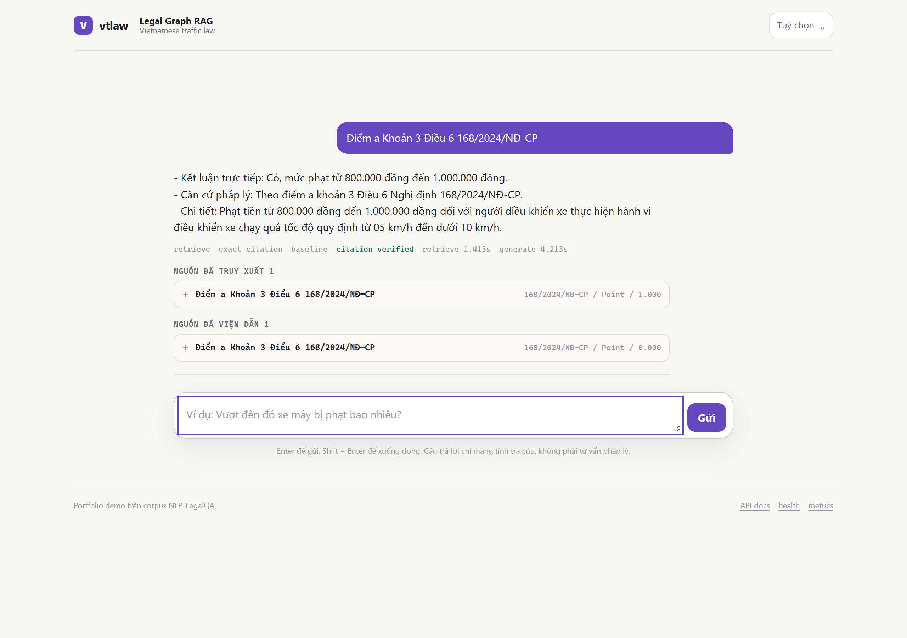
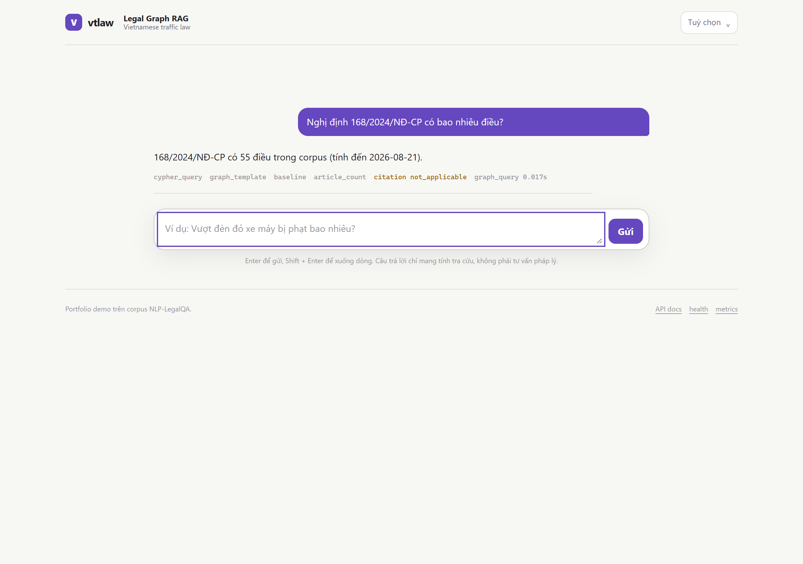
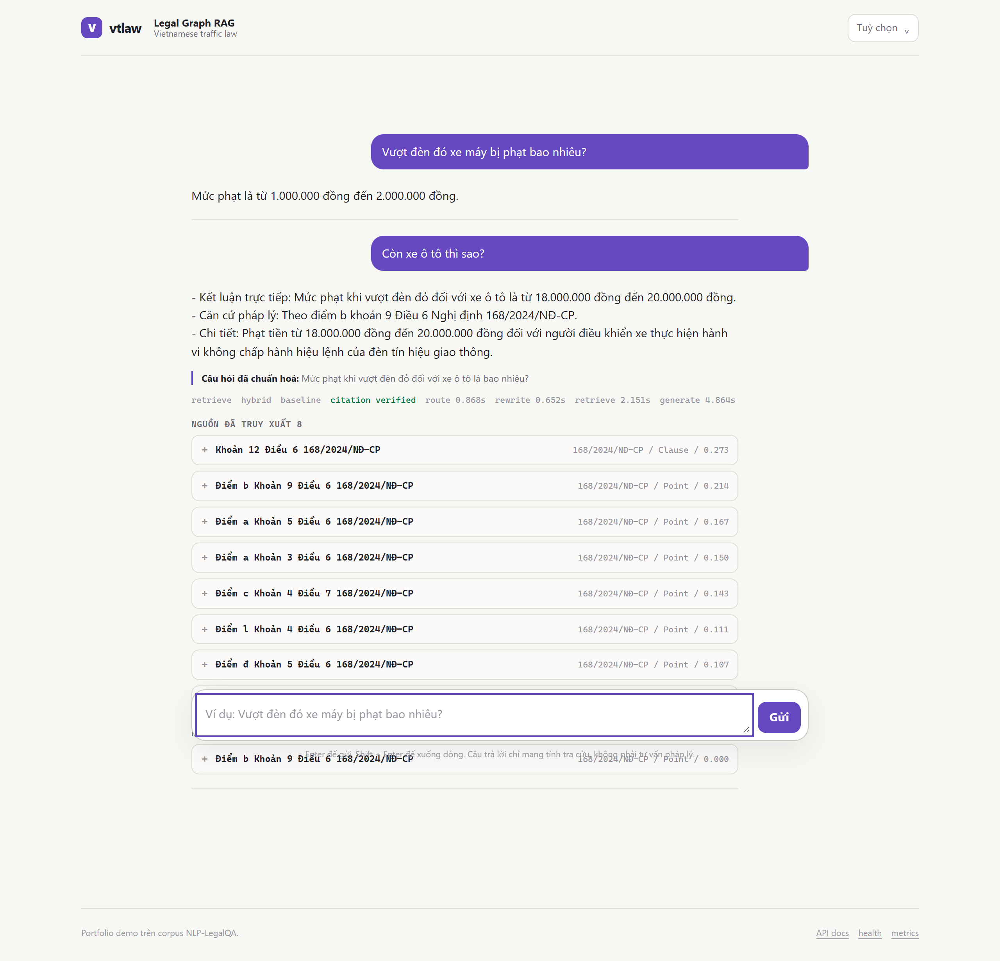

# vtlaw — Vietnamese Legal Graph RAG

Vietnamese road-traffic law as a queryable graph: 7,381 citable provisions in
Neo4j, answers that cite Điều/Khoản/Điểm or refuse to answer at all. Its
GraphRAG behavior is an amendment-aware ranking heuristic over recorded
`AMENDS` annotations, not legal consolidation or a legal-validity oracle.

The current hash-verified release uses k=8 and reports Recall@8 0.2766 on QA_Part2345.
The historical k=5 artifact reports Recall@5 0.6012 on the same question track.
The served and default evaluation contract returns/scores 8 contexts.
`fetch_k=30` fetches 30 candidates per retrieval leg; results are fused into a
30-item `candidate_k` fused candidate pool, which an enabled reranker receives
as `rerank_top=30` before `context_k = top_k = 8` is returned/scored. It reports
Recall@8, Precision@8, and MRR@8. The 2026-08-20 Recall@5 artifacts below are
historical pre-contract evidence, not the current k=8 release benchmark.

Built on the fixed corpus, QA labels, and amendment annotations from
[NLP-LegalQA](https://github.com/n3sfan/NLP-LegalQA), with an independent
parser, graph, retrieval stack, API, and evaluation harness.

This is a portfolio system, not a legal-advice service. It is deliberately
honest about both what the graph proves and what the fixed source data cannot.

→ [Portfolio case study](docs/portfolio-case-study.md) ·
[Benchmark report](docs/benchmark.md) · [Data provenance](data/README.md)

## The four retrieval paths, as they render

A plain-language question goes through hybrid retrieval, and every cited
provision is checked against the evidence that was actually rendered:


A full `Điểm / Khoản / Điều + document` citation resolves to exactly one
provision — no approximate search runs at all:



A counting or metadata question routes through safe read-only template
selection: the model may select one server-owned parameterized query, but can
never generate or execute arbitrary Text-to-Cypher. The answer includes its
legal date:



A follow-up is rewritten into a standalone question, and that rewrite is what
both retrieval *and* generation receive:



## Historical comparison with the upstream project

Both sets of numbers are retrieval metrics on the **same 200 questions**:
upstream reports per-part means over `QA_Part2`–`QA_Part5`, which is the same
question set, in the same order, as the `QA_Part2345.csv` track used here
(50 rows per part, so a mean of means equals the pooled mean). Same corpus,
same `bkai-foundation-models/vietnamese-bi-encoder`.

| Pipeline | Recall@5 | MRR | LLM calls per query |
|---|---:|---:|---|
| NLP-LegalQA — basic RAG | 0.4892 | 0.4626 | 0 |
| **vtlaw — baseline** (hybrid + weighted RRF; historical 2026-08-20 artifact) | **0.6012** | **0.5885** | 0 |
| vtlaw — decomposition profile (historical) | 0.6192 | 0.5637 | 1 |
| NLP-LegalQA — full pipeline (rerank top-30 + Borda/max aggregation) | 0.6711 | 0.7033 | 1+ |

The vtlaw baseline row is the most recent measured result, but it remains
historical k=5 evidence under the current k=8 contract. The decomposition row
is an older LLM experiment and is not an apples-to-apples current comparison.

Read honestly: the historical 2026-08-20 deterministic artifact is 22.9% higher in Recall@5
than NLP-LegalQA's reported deterministic baseline, under the caveat below.
Upstream's full pipeline still reports higher scores, particularly MRR. Its
cross-encoder/rank-aggregation trade was measured here and rejected as a
default because the historical full-track reranker result is mixed and costs
7–9 s p50 (see [benchmark.md](docs/benchmark.md)).

Caveats that belong next to the table: upstream's relevance test is a plain
`startswith`, this one requires the match to land on a `::` UID boundary — on
these rows the two agree to 4 decimal places, but they are not the same
predicate. Upstream's own numbers were not re-measured here; they are quoted
from its committed `eval_results/`.

## What is implemented

```text
NLP-LegalQA snapshot
        │
        ▼
conversation history ──► intent router ──► direct / reject / graph template
        │                                           │
        ▼                                           ▼
follow-up rewrite ──► exact citation or vector + BM25 + weighted RRF
                                      │
                                      ▼
                          graph context + cited LLM answer
                                      │
                                      ▼
                     citation check → one repair → evidence fallback
```

- 12 fixed source documents, parsed into 7,381 citable provisions.
- A graph hierarchy preserves `Document → Article → Clause → Point`; a Point
  can be expanded with its parent Clause, where a penalty amount often lives.
- 440 resolved `AMENDS` edges represent NLP-LegalQA amendment annotations.
- Every retrieval accepts `as_of`; it filters document effective/expiry dates.
  The served AMENDS heuristic keeps its candidate pool until temporal demotion
  is complete, so an in-force candidate below the initial top-k can be promoted.
  It applies an effective Article/Clause amendment to retrieved descendants for
  `bãi bỏ`, `thay thế`, `sửa đổi`, and `sửa đổi, bổ sung`; `bổ sung` alone is
  not demoted.
- A full `Điều / Khoản / Điểm + document identity` citation is resolved exactly
  before approximate retrieval. Ambiguous citations stay on the hybrid path.
- The baseline is deterministic hybrid retrieval. LLM query decomposition is a
  measured quality profile; the cross-encoder reranker remains an explicit
  experiment because its full-track result is mixed and much slower. Before
  loading the CPU model, it requires `RERANK_MIN_AVAILABLE_MEMORY_MB` of free
  physical memory (2 GiB by default); otherwise it returns the non-reranked
  result rather than risking an API-process crash.
- The router follows NLP-LegalQA's four intents (`direct_answer`, `retrieve`,
  `reject`, `cypher_query`). Its graph-query feature is safe read-only template
  selection among three parameterized server-owned queries (article count,
  signers, amendment history), never arbitrary Text-to-Cypher.
- Multi-turn follow-ups are rewritten to a standalone question only after the
  original message is routed. Generated answers are checked against retrieved
  evidence; an unverified answer gets one constrained repair, then a cited
  evidence fallback rather than an unsupported legal claim.
- API includes `/health`, `/metrics`, request IDs, optional API-key protection,
  loopback binding by default, rate limiting, CORS allow-listing, and Redis
  caching keyed by corpus, model, retrieval profile/configuration, and `as_of`
  date. A dependency-free chat UI is served at `/`.

## Legal-temporal boundary

At a supplied `as_of`, retrieval demotes a target provision when an effective
source document has a recorded `bãi bỏ`, `thay thế`, `sửa đổi`, or `sửa đổi,
bổ sung` AMENDS annotation; `bổ sung` alone does not trigger demotion. This is
annotation-based ranking behavior, not a determination of which legal rule
applies. The graph **cannot** reconstruct a new, consolidated version of every
amended provision: the corpus contains amendment instructions, not a verified
consolidated text. The system therefore never pretends to synthesize a
replacement rule; it cites the retrieved source and keeps that limitation
explicit.

This amendment-aware GraphRAG step is a heuristic. The measured citation-
currency stages on 2026-08-20 were **16/31 → 8/31 → 2/31**, from
`2026-08-20-citation-currency-before.json` to
`2026-08-20-citation-currency-after.json` to
`2026-08-20-citation-currency-hierarchy-fixed.json`.

The project uses only the committed NLP-LegalQA artifacts. Scraper code is kept
to make the original acquisition path inspectable, but normal operation is
offline and does not fetch PDFs or another legal source. The upstream endpoint
currently rejects or errors on requests, and the client stops on refusal rather
than trying to bypass it. See [data/README.md](data/README.md).

## Evaluation evidence and reruns

The two historical k=5 baseline artifacts below were rerun after Precision@k was corrected,
the evaluator was aligned with the served AMENDS heuristic, and temporal
demotion was applied before top-k truncation. They each cover all valid rows
with zero retrieval errors. They were generated before this working tree was
committed, so their provenance says `git_dirty: true`; commit and rerun before
making a commit-reproducibility claim.

Each new `vtlaw eval run` JSON records corpus/model/retrieval settings, legal
`as_of` date, the exact command, aligned candidate/fetch/rerank/context budgets,
dataset SHA-256, and skipped rows. It also records `provenance`
(snapshot-manifest SHA-256, Git commit, and dirty state), `selection` (limit,
method, loaded rows, and selected rows), and the applied heuristic/rerank
settings. It also records `label_currency`: the portion of reference UIDs the
AMENDS graph marks superseded at the selected `as_of` date.

```bash
vtlaw eval run data/evaluation/qa/QA_NLP.csv \
  --top-k 5 --as-of 2026-08-20 \
  --output data/evaluation/results/2026-08-20-qa-nlp-baseline-current.json

vtlaw eval run data/evaluation/qa/QA_Part2345.csv \
  --top-k 5 --as-of 2026-08-20 \
  --output data/evaluation/results/2026-08-20-qa-part2345-baseline-current.json
```

`QA_Part2`–`QA_Part5` concatenate exactly into `QA_Part2345`; they must not be
averaged as independent datasets. The current baseline, historical experiments,
and rerun requirements live in [docs/benchmark.md](docs/benchmark.md).

## Quick start

```bash
cp .env.example .env
# Set NEO4J_PASSWORD in .env (and LLM_API_KEY only if generation is wanted).

docker compose up -d

uv venv
uv pip install \
  --extra-index-url https://download.pytorch.org/whl/cpu \
  --index-strategy unsafe-best-match \
  -e ".[dev,embed,serve,worker]"

vtlaw scrape verify             # hash-check only; no network access
vtlaw parse check               # 12 docs -> 7,381 provisions
vtlaw graph import --wipe       # imports hierarchy and AMENDS annotations
vtlaw embed run                 # model/provenance-aware vector refresh
vtlaw graph status              # read counts and amendment edges back
```

After a source re-import, provision vectors are cleared deliberately: their
input text may have changed. Run `vtlaw embed run` again; it refreshes only
vectors whose embedding fingerprint is stale or missing.

```bash
# Deterministic retrieval-only query
vtlaw retrieve search "không đội mũ bảo hiểm phạt bao nhiêu"

# Exact citation lookup (no vector search needed for this query)
vtlaw retrieve search "Điểm a Khoản 3 Điều 6 168/2024/NĐ-CP"

# Retrieval scoped to a past legal date
vtlaw retrieve search "vượt quá tốc độ" --as-of 2024-06-01

# LLM-backed answer, with a legally scoped date
vtlaw generate answer "vượt quá tốc độ phạt bao nhiêu" --as-of 2025-01-01

# HTTP API on http://127.0.0.1:18080
vtlaw api serve
```

Open <http://127.0.0.1:18080/> for the portfolio chat UI. It exposes the
retrieval profile, legal date, evidence, routing decision, citation status, and
timings without adding a frontend runtime dependency.

### Optional CUDA profile

The quick-start command installs CPU PyTorch deliberately: the deterministic
hybrid baseline must run on an ordinary machine. On a Windows NVIDIA host,
install the matching CUDA wheels in a separate environment, then use the
existing `auto` device setting:

```powershell
uv pip install --reinstall torch==2.6.0 torchvision==0.21.0 `
  --index-url https://download.pytorch.org/whl/cu124
$env:EMBED_DEVICE = "cuda"
vtlaw api serve
```

CUDA was validated on an RTX 3050 for both the bi-encoder and the real
cross-encoder. Keep `RERANK_MIN_AVAILABLE_MEMORY_MB=2048` unless the host and
GPU profile have been measured: the 256 MiB setting used for the documented GPU
experiment is a machine-specific test override, not a portable default. The
reranker remains opt-in because its current QA_NLP k=8 evaluation trades recall
and MRR for a small precision gain; see [the benchmark](docs/benchmark.md).

Example API call:

```bash
curl -X POST http://127.0.0.1:18080/chat \
  -H "Content-Type: application/json" \
  -d '{"question":"không đội mũ bảo hiểm phạt bao nhiêu","as_of":"2025-01-01"}'
```

## Development checks

```bash
uv run --no-sync ruff check src/ tests/
uv run --no-sync pytest -m "not integration" -q
VTLAW_TEST_WIPE=1 uv run --no-sync pytest -m integration -q
```

Integration tests wipe Neo4j, so run them only against the isolated CI service
or an expendable local database. They require the explicit `VTLAW_TEST_WIPE=1`
opt-in. GitHub Actions runs lint, offline tests,
isolated Neo4j/Redis integration tests, and a non-root Docker image import
check.

## Scope and Definition of Done

The project is complete for its stated portfolio scope when all of the
following hold:

1. Snapshot hashes, parser counts, graph counts, AMENDS edges, and embedding
   coverage agree with their read-back checks.
2. Unit and isolated integration tests pass; Docker builds and imports.
3. After an evaluator or retrieval-semantics change, the two non-overlapping
   reporting tracks are rerun with a recorded `as_of` date and their generated
   JSON is summarized in `docs/benchmark.md`; until then, artifacts remain
   labelled pre-change historical evidence.
4. API health is green with Neo4j and Redis; baseline, decomposition, safe
   graph-template, and multi-turn `/chat` flows return the stated contracts.
5. Every generated API answer is either citation-verified against its retrieved
   evidence or replaced with a cited evidence fallback; this is a citation
   provenance check, not proof of legal correctness.
6. The root UI renders from the built Docker image as well as the source tree.

That scope intentionally excludes live crawling, PDF/OCR ingestion, arbitrary
LLM Cypher execution, and legal consolidation. Those require authoritative
source access or a separate validation process rather than more retrieval code.

## Layout

```text
src/vtlaw/
  scrape/      reproducible acquisition client; not part of normal runtime
  parse/       Vietnamese legal-structure parser and citable UID model
  graph/       Neo4j schema, hierarchy importer, AMENDS importer, safe templates
  embed/       pinned Vietnamese bi-encoder and provenance-aware indexer
  retrieve/    exact citation lookup, vector/BM25/RRF, router, temporal safeguards
  generate/    context construction, grounded generation, citation verification
  api/         FastAPI application, operational middleware, static chat UI
  eval/        Recall@k, MRR, latency, provenance and selection metadata
  ingest/      optional ARQ maintenance worker

data/          committed NLP-LegalQA snapshot, labels, and annotations
tests/         offline unit tests and isolated Neo4j integration tests
```

## Licence

MIT. Corpus provenance and constraints are documented in
[data/README.md](data/README.md).
