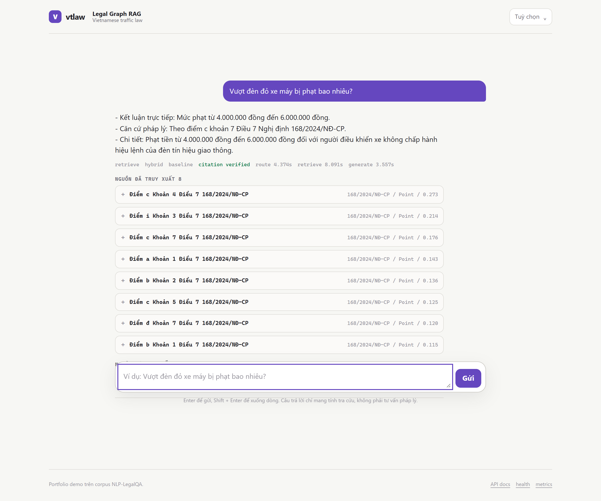

# vtlaw — Portfolio case study

## One line

A reproducible Vietnamese legal Graph RAG whose deterministic, zero-LLM
retrieval path beats the upstream research baseline by 15% relative Recall@5 —
and whose every reported number carries the corpus hash, model revision, and
legal date that produced it.
## Problem

Legal retrieval is not semantic search with extra steps. Three things break a
naive RAG on Vietnamese traffic law:

1. **A provision alone is not an answer.** A Point states the offence; the
   penalty amount lives in its parent Clause. Return the Point and you have
   something that reads like an answer with the number missing.
2. **A citation is not a query.** "Điểm a Khoản 3 Điều 6 168/2024/NĐ-CP" has
   exactly one correct answer. Approximate search on it is a bug.
3. **Law has dates.** A document not yet in effect, or already expired, must
   not be presented as applicable — and an amendment recorded in 2025 says
   nothing about a question asked as of 2024.

## What I built

- Parsed 12 NLP-LegalQA documents into 7,381 stable `Document → Article →
  Clause → Point` nodes in Neo4j, handling the cases a line-matching parser
  gets wrong: quoted amendment text is content, not structure (2,123 lines
  across the corpus, where a bare `Điều 5.` names another law rather than
  opening a section here), letter-suffixed numbering is real legal text
  (`Điều 18a`, 18 such headers — all of them inside quoted blocks on this
  corpus, so the branch exists for the next document, not this one), and
  duplicate numbering must not merge (2 clauses).
- Imported 440 resolved amendment edges and date-bounded their effect on
  ranking by the amending document's own effective date.
- Added exact lookup for a full `Điều / Khoản / Điểm + document` citation;
  ambiguous questions fall through to vector + BM25 weighted-RRF retrieval.
- Weighted the fusion legs by measured quality (vector 3 : BM25 1). Equal
  weights let BM25's ordering drag the fused list *below* plain vector search.
- Measured NLP-LegalQA-inspired query decomposition and shipped it as an
  explicit profile: Recall@5 0.7713 → 0.8599 on QA_NLP, at ~1.5 s p50. Ran it
  twice a day apart to show it is *not* reproducible to the digit (±0.014 at
  `temperature=0`), which is why it is not the default.
- Measured the cross-encoder reranker and **rejected it as default**: 7–9 s p50
  and a *regression* on one of two tracks. It stays an opt-in experiment,
  labelled as such in the UI.
- Added the upstream four-way intent contract plus multi-turn rewriting. The
  graph branch executes three parameterized read-only templates, never raw
  LLM-generated Cypher.
- Constrained generation to retrieved evidence: verify each cited provision
  against the hits, attempt one evidence-only repair, then return a cited
  fallback rather than an unverifiable legal claim.
- Made vector provenance explicit: an embedding fingerprint over
  model@revision + segmenter + text version forces a refresh when any input
  changes, so an index can never silently disagree with its weights.
- Exposed it through FastAPI with real dependency health checks, Redis caching,
  request IDs, sliding-window rate limiting, optional API-key auth, and a
  non-root Docker image.
- Served a dependency-free responsive chat UI showing evidence, legal date,
  profile, router decision, citation status, and per-stage timings.

## Evidence

| Check | Result |
|---|---|
| Corpus / graph | 12 documents, 7,381 provisions, 440 `AMENDS` edges |
| Embedding coverage | 566 Articles, 2,763 Clauses, 4,052 Points — 100% |
| Baseline QA_NLP / QA_Part2345 | Recall@5 0.7713 / 0.5637; MRR 0.6449 / 0.5127 |
| Decomposition QA_NLP / QA_Part2345 | Recall@5 0.8599 / 0.6192; MRR 0.6757 / 0.5637 |
| Baseline reproducibility | identical to four decimals across two runs, two days apart |
| Decomposition reproducibility | ±0.014 Recall@5 run-to-run; reported as a range, not a point |
| vs upstream basic RAG (same 200 rows) | 0.5637 vs 0.4892 Recall@5, zero LLM calls either side |
| Reranker decision | rejected as default: regresses QA_NLP, costs 7–9 s p50 |
| Stale-citation rate | 0.484 → 0.226 on the 31 questions where two decrees compete |
| Latency | 0.18 s p50 baseline; 1.5–1.7 s p50 with decomposition |
| Quality gates | 378 offline tests, isolated Neo4j integration suite, Ruff, Docker build/import/non-root check |

The two QA tracks are reported separately because `QA_Part2`–`QA_Part5`
concatenate exactly into `QA_Part2345`. Full conditions and limits:
[benchmark.md](benchmark.md).

## Engineering decisions worth defending

| Decision | Why |
|---|---|
| Deterministic baseline, LLM as an opt-in profile | A reproducible number needs a pipeline with no sampling in it. Running decomposition twice confirmed it: ±0.014 Recall@5 at `temperature=0`, while the deterministic path repeated to four decimals. |
| Rejected the reranker despite it being the obvious "add a reranker" move | It regressed one track and cost 50× the latency. Adding it would have been a checklist item, not an improvement. |
| Parameterized graph templates instead of text2cypher | An LLM writing Cypher against a live database is an arbitrary-query primitive. Three bounded templates cover the questions users actually ask. |
| Citation verification with one repair, then fallback | An unsupported legal citation is worse than no answer. The fallback cites sources and says it could not verify. |
| Score-span-relative amendment demotion | An absolute penalty of −5.0 against an RRF list (span ~0.3) does not demote a hit, it replaces the ranking. |
| Report only cutoffs the run measured | A `--top-k 5` run reporting recall@10 shows a plateau that is really truncation. |
| Built a new metric rather than trusting Recall@k | Two decrees both in effect, both retrieved: Recall@5 scores it a hit while the answer cites the superseded one. A defect no existing metric can see needs its own measurement, not a hunch. |

## 90-second demo



```powershell
docker compose up -d
vtlaw graph status
vtlaw embed status
vtlaw retrieve search "Điểm a Khoản 3 Điều 6 168/2024/NĐ-CP"
vtlaw api serve
```

In a second terminal:

```powershell
Invoke-RestMethod http://127.0.0.1:18080/health
Start-Process http://127.0.0.1:18080/
```

The UI ships four example questions, one per path. Point out that the exact
citation resolves to one provision with no approximate search, while a
plain-language question follows hybrid retrieval. Then ask
`Nghị định 168/2024/NĐ-CP có bao nhiêu điều?` for the safe graph-template
route, and a follow-up to show the rewritten standalone question. Every reply
carries its citation-provenance verdict and per-stage timings.

Screenshots of all four paths are in the [README](../README.md#the-four-retrieval-paths-as-they-render);
regenerate them with `scripts/capture_screenshots.py` against a running API.

## Honest boundary

Taking my own screenshots found a bug the retrieval metrics rate as a success.
Two penalty decrees, `100/2019/NĐ-CP` and `168/2024/NĐ-CP`, are both in effect
with no expiry date; retrieval returns provisions from each, Recall@5 counts the
hit, and the model cited the 2020 one. The date filter cannot separate two live
documents, amendment demotion only covers annotated edges, and citation
verification checks provenance rather than currency — so no existing layer was
even looking.

I measured it instead of guessing: 15 of 31 questions where two decrees compete
cited only the superseded one. Naming the newest decree explicitly in the prompt
took that to 7. The remaining 7 are not a prompting problem — they are behaviours
the newer decree does not clearly cover, and the corpus holds no consolidated
text to arbitrate. That number is recorded, not rounded away.

This is a production-minded portfolio system, not a legal-advice product. It uses
only the fixed NLP-LegalQA artifacts. Amendment instructions are modeled as graph
evidence, but the project does not fabricate consolidated legal text or claim
that retrieval labels establish legal applicability without a date-of-fact.
Citation verification checks provenance, not legal correctness. The graph API
intentionally does not execute arbitrary LLM-generated Cypher. Upstream's
published numbers are quoted from its committed `eval_results/`, not re-measured
here.

## CV bullets

- Built a Vietnamese legal Graph RAG over 7,381 citable provisions in Neo4j —
  exact-citation resolution, weighted-RRF hybrid retrieval, date-scoped
  temporal filtering, multi-turn resolution, and parameterized read-only graph
  queries instead of LLM-generated Cypher.
- Raised Recall@5 from 0.4892 (research baseline) to 0.5637 with zero LLM calls
  and to 0.86 on the primary track with a measured decomposition profile;
  rejected a cross-encoder reranker on evidence after it regressed one track
  and added 7–9 s p50.
- Designed a reproducible evaluation harness recording corpus SHA-256, pinned
  embedding revision, fusion weights, `as_of` date, and dropped rows; verified
  the deterministic path repeats to four decimals and quantified the LLM
  profile's ±0.014 run-to-run spread rather than quoting its best run.
- Productionized the service with FastAPI, Redis caching keyed on retrieval
  provenance, Prometheus metrics, request-scoped tracing, rate limiting,
  citation-provenance guard with repair-then-fallback, non-root Docker, and CI
  running lint, offline tests, isolated Neo4j/Redis integration tests, and an
  image import check.
